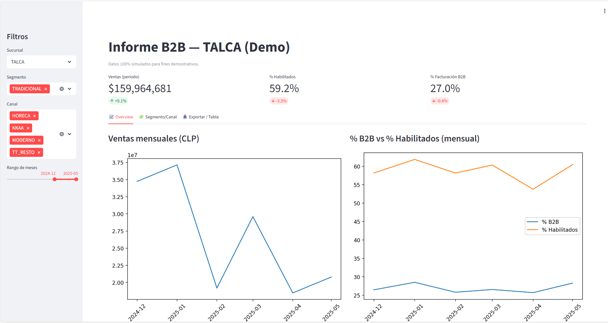

# B2B Dashboard (Streamlit Demo)

Pequeño dashboard con datos **simulados** (Sucursal, Segmento, Canal, % habilitados y % facturación B2B).

## Cómo usar (Codespaces o local)

### 1) Instalar dependencias
```bash
pip install -r requirements.txt
